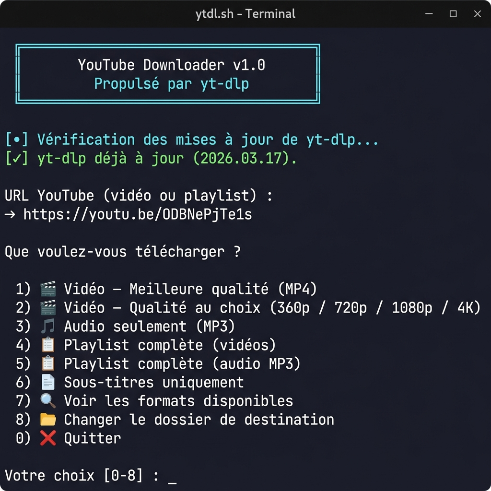

# 📺 ytdl — Téléchargeur YouTube en ligne de commande

[](LICENSE)
[](ytdl.sh)
[](https://github.com/yt-dlp/yt-dlp)
[](https://ubuntu.com)

> Script Bash interactif pour télécharger des vidéos et playlists YouTube directement depuis le terminal.  
> Propulsé par [yt-dlp](https://github.com/yt-dlp/yt-dlp) et [ffmpeg](https://ffmpeg.org/).

🔗 **Repo GitHub :** [github.com/yannmael/youtube-downloader](https://github.com/yannmael/youtube-downloader)

---

## ✨ Fonctionnalités

| Option | Description |
|--------|-------------|
| 🎬 Meilleure qualité | Télécharge la vidéo en MP4 à la meilleure résolution disponible |
| 🎬 Qualité au choix | Sélection parmi 360p, 480p, 720p, 1080p, 1440p, 4K |
| 🎵 Audio MP3 | Extraction audio en MP3 qualité maximale |
| 📋 Playlist vidéo | Téléchargement d'une playlist complète en MP4 |
| 📋 Playlist audio | Téléchargement d'une playlist complète en MP3 |
| 📄 Sous-titres | Téléchargement des sous-titres dans la langue de votre choix |
| 🔍 Formats disponibles | Affichage des formats disponibles pour une URL donnée |
| 📁 Dossier personnalisé | Modification du dossier de destination à la volée |

---

## 🚀 Installation

### Prérequis

- **Ubuntu 24.04** (ou toute distribution Debian-based)
- **ffmpeg** — pour la fusion audio/vidéo et la conversion MP3

```bash
sudo apt install ffmpeg nodejs
```

> `yt-dlp` est installé et mis à jour **automatiquement** au démarrage du script.

### Utilisation

```bash
# Rendre le script exécutable (une seule fois)
chmod +x ytdl.sh

# Lancer
./ytdl.sh
```

---

## 🖥️ Aperçu

```
  ╔══════════════════════════════════════╗
  ║       YouTube Downloader v1.0        ║
  ║         Propulsé par yt-dlp          ║
  ╚══════════════════════════════════════╝

[•] Vérification des mises à jour de yt-dlp...
[✓] yt-dlp déjà à jour (2026.03.17).

URL YouTube (vidéo ou playlist) :
  → https://youtu.be/...

Que voulez-vous télécharger ?

  1) 🎬  Vidéo — Meilleure qualité (MP4)
  2) 🎬  Vidéo — Qualité au choix (360p / 720p / 1080p / 4K)
  3) 🎵  Audio seulement (MP3)
  4) 📋  Playlist complète (vidéos)
  5) 📋  Playlist complète (audio MP3)
  6) 📄  Sous-titres uniquement
  7) 🔍  Voir les formats disponibles
  8) 📁  Changer le dossier de destination
  0) ❌  Quitter
```

---

## 📁 Dossier de destination

Par défaut, les fichiers sont téléchargés dans :

```
~/Téléchargements/Youtube/
```

Ce chemin peut être modifié à tout moment via l'option `8` du menu.

---

## 🔧 Dépendances

| Outil | Rôle | Installation |
|-------|------|--------------|
| `yt-dlp` | Téléchargement YouTube | Automatique via pip |
| `ffmpeg` | Fusion vidéo/audio, conversion MP3 | `sudo apt install ffmpeg` |
| `nodejs` | Runtime JS pour yt-dlp (optionnel) | `sudo apt install nodejs` |

---

## 📸 Aperçu



---

## ⚠️ Limitations

- Pas d'interface graphique
- Pas de téléchargements en arrière-plan
- Pas de gestion de comptes ou de cookies

---

## 📄 Licence

Ce projet est distribué sous licence [MIT](LICENSE).
